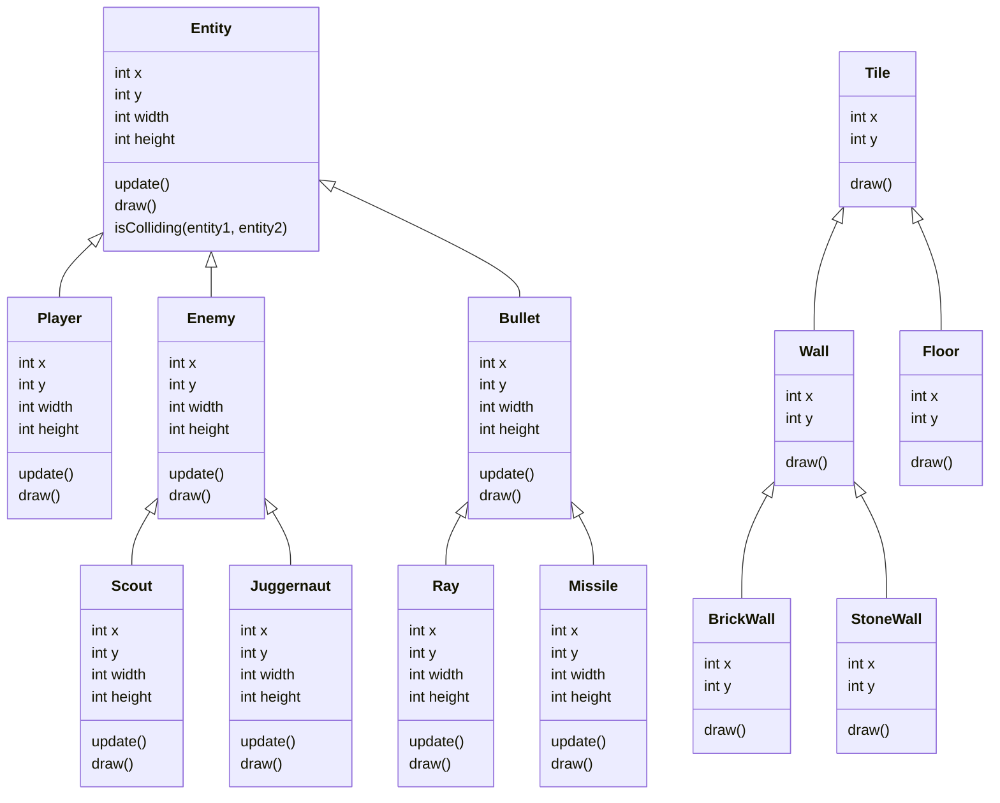
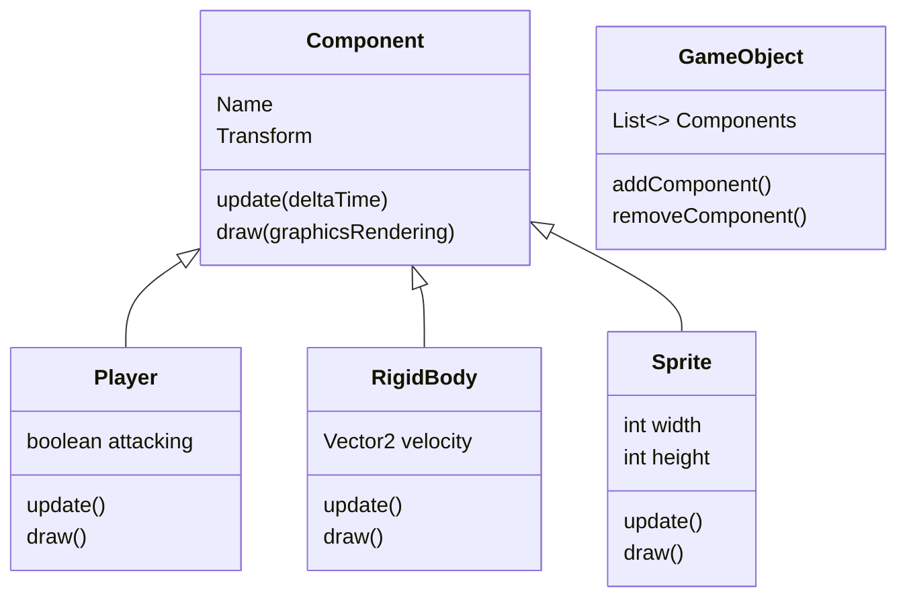

# 

# *Entity Component System:*

This game uses Entity Component System, but what this means?

---

## In the past:

So, in the past, game developers created a system based in OOP (Oriented Objects Programming).
In this system, we have an Entity class that is mother of Player, Enemy... And others types of class like Tile that is mother of Wall, Floor...

This is a map to show how this system may looks like

| Note: | Tiles are the Game Objects that don't move, which are frozen in the map, like trees, walls, grass... |
| ----- | ---------------------------------------------------------------------------------------------------- |

It seems complicated, doesn't it?
But, luckily, we have Entity Component System nowadays.

---

### Nowadays:

Today, we have a better, faster and easier system, Entity Component System.
According to this system, any game object must extend GameObject class.

But how we make the collisions between player and enemies, or just create a button which is very different from the Player but have the same ancestor?
Well, according this system, Game Objects are like common cars. It has a door, windows, seats... 

But if you want air conditioner, a TV or something unusual, you have to attach it to your car.
This system it's literally that.

If we want to add collision to the Player for example, we attach it a RigidBody Component, if we want to add a shape or a size to it, we attach it a BoxBounds Component...
And this is how (more or less) an Entity Component System looks like:

Very simpler and easy to understand, isn't it?

---

This is how Entity Component System works. I hope that I had turned the project more understandable and made you learning curve more interesting and funny.

Thank you :D
